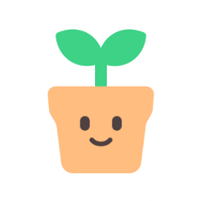

# 식집사

**식집사**는 식물을 사랑하는 사람들을 위한 물주기 앱입니다. 이 앱은 식물을 기록하고 물을 준 날짜와
물의 양을 기록할 수 있습니다. 이렇게 기록할 경우, 식물이 언제 물을 받았는지 쉽게 파악할 수 있고,
물을 주는 주기를 조절할 수 있습니다.

식집사는 직관적인 UI를 제공합니다. 물을 주어야 할 때, 알림을 통해 알려줍니다. 또한, 식물의 이름,
종류, 사진, 채광 정보 등을 기록할 수 있어, 식물의 정보를 쉽게 확인할 수 있습니다.

이 앱은 여러분이 식물을 키우는 데에 큰 도움이 될 것입니다. 다운로드 받아서 식물을 키우는 즐거움을 더해보세요!

email: contact@team726.com
